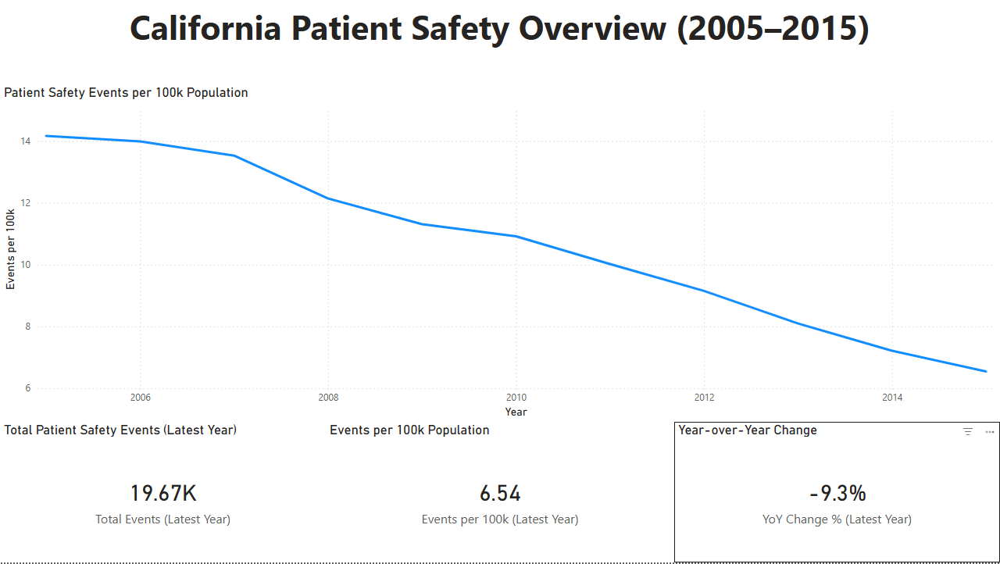

# California Patient Safety Overview (2005–2015)

End-to-end analytics project analyzing California patient safety event trends using a public PSI dataset. The project covers ingestion into MySQL, standardized SQL metrics, data quality validation, and an executive Power BI dashboard.

## Objective
Provide an executive-friendly view of patient safety performance over time, including:
- Trend in events per 100k population
- Latest-year KPIs
- Year-over-year (YoY) change

## Data
Public California OSHPD Patient Safety Indicators dataset (2005–2015), aggregated by county and year. No PHI.

## Tools
- **MySQL** (storage + reusable SQL views)
- **Python (pandas)** (CSV ingestion and type handling)
- **SQL** (metrics + data quality checks)
- **Power BI + DAX** (dashboard + “latest year” KPIs)
- **ODBC DSN** (Power BI ↔ MySQL connection)

## What I Built
- CSV → MySQL ingestion pipeline
- Metrics layer implemented as SQL views (standardized definitions)
- Data quality checks (nulls, duplicates, PSI description consistency)
- Executive dashboard:
  - Events per 100k trend line (2005–2015)
  - Latest-year cards: total events, events per 100k, YoY change %

## Repository Structure
- `data/` – raw dataset
- `python/` – ingestion scripts
- `sql/` – metrics + data quality checks
- `dashboards/` – Power BI report file (`.pbix`)

## Dashboard
Open the `.pbix` file in `dashboards/` using Power BI Desktop.

## Author
Austin Knighton
